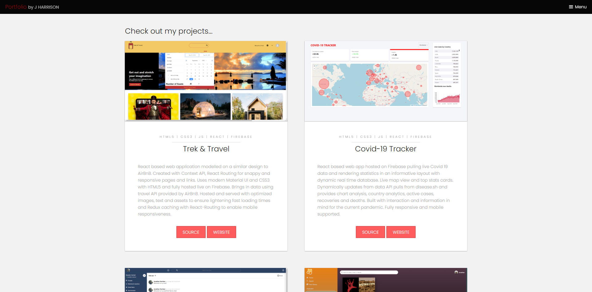
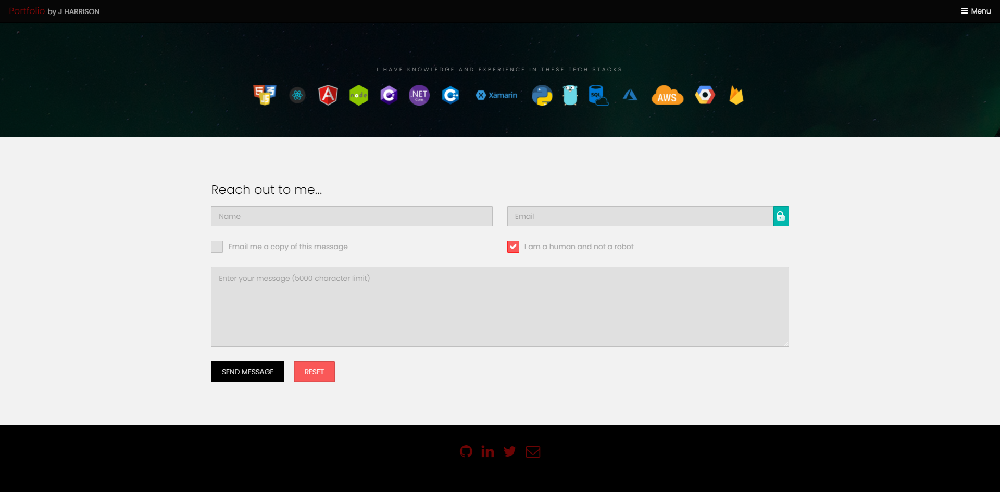

# My Portfolio Site

A custom made, single page, responsive website to demonstrate my web dev skill set and link to other projects, both personal and opensource collaborations, as and when ready for public show and tell. As such source code for this site will be made public for prospective hiring.

INcorporates smoothscrolling, smooth CSS animations, dynamic banner, simple and vibrant colour design, easy to read flow, custom links, buttons, forms and client-side alongside server side validation. Utilizes JQuery library for frontend design and interaction as well as some vanilla JS with php backend for server-side validation, email and input processing.

Links to my personal Gitlab, open-source contributions on Github, my professional Twitter social feed and LinkedIn profile. All projects on the site are rotated on occasion to showcase my best or most recent work and are hosted live on various platforms such as Heroku, Firebase, AWS, Azure or Netlify. Check the description for the languages used, key frameworks/libraries and hosting methods. 

https://portfolio-site-a770f.web.app/

## Landing Page Banner

## Collapsable Hamburger Menu 

## Project Cards

## Skills and Contact Methods

